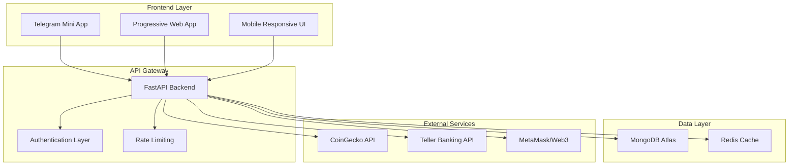
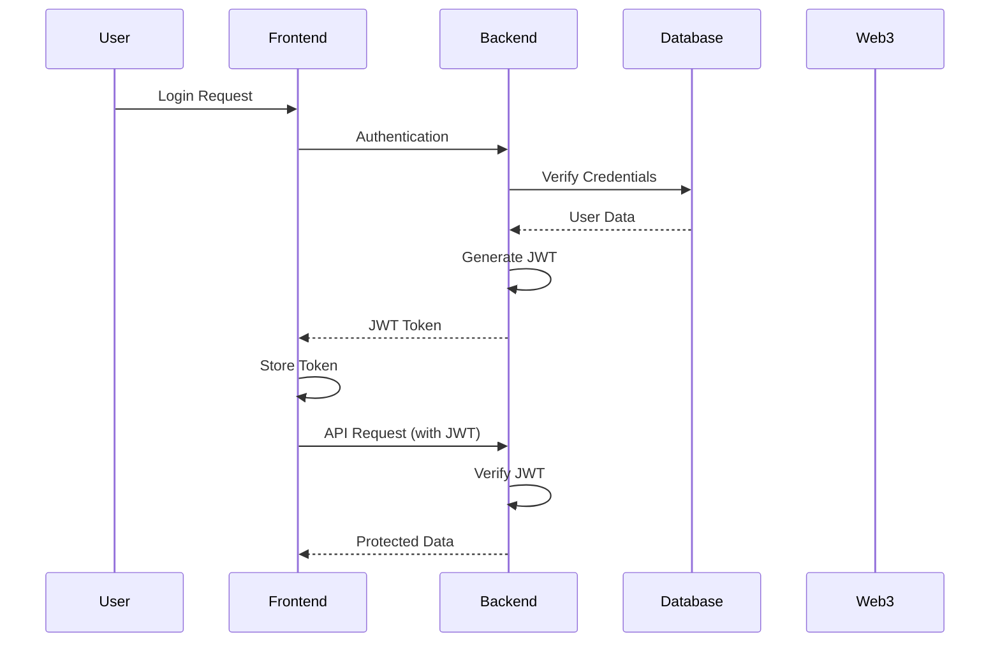
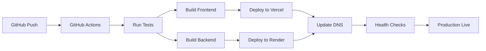

# 🏗️ VonVault Architecture Documentation

> **Comprehensive technical architecture for a production-ready DeFi Telegram Mini App**

---

## 🎯 **System Overview**

VonVault is built as a modern, scalable DeFi application using a microservices architecture with clear separation of concerns, enabling rapid development and easy maintenance.



---

## 🎨 **Frontend Architecture**

### **React + TypeScript Structure**

```typescript
frontend/src/
├── components/              # Reusable UI components
│   ├── screens/            # Page-level components (16 screens)
│   ├── common/             # Shared UI components
│   └── layout/             # Layout and navigation components
├── hooks/                  # Custom React hooks
│   ├── useAuth.ts         # Authentication management
│   ├── usePortfolio.ts    # Portfolio data management
│   └── useApi.ts          # API communication
├── services/              # External service integrations
│   ├── api.ts            # Backend API client
│   ├── web3.ts           # Blockchain interactions
│   └── analytics.ts      # User tracking
├── context/              # React Context providers
│   ├── AppContext.tsx    # Global app state
│   ├── AuthContext.tsx   # Authentication state
│   └── ThemeContext.tsx  # UI theme management
├── types/               # TypeScript definitions
│   ├── index.ts        # Core type definitions
│   ├── api.ts          # API response types
│   └── user.ts         # User-related types
└── utils/              # Utility functions
    ├── formatters.ts   # Data formatting
    ├── validators.ts   # Input validation
    └── constants.ts    # App constants
```

### **State Management Pattern**

```typescript
// Centralized state management using React Context
interface AppState {
  user: User | null;
  portfolio: Portfolio | null;
  investments: Investment[];
  loading: boolean;
  error: string | null;
}

// Custom hooks for state management
const useAuth = () => {
  // Authentication logic
  // JWT token management
  // User session handling
}

const usePortfolio = () => {
  // Portfolio data fetching
  // Real-time updates
  // Cache management
}
```

### **Component Design System**

```typescript
// Reusable component library with consistent patterns
interface ButtonProps {
  variant: 'primary' | 'secondary' | 'danger';
  size: 'sm' | 'md' | 'lg';
  loading?: boolean;
  disabled?: boolean;
  fullWidth?: boolean;
}

// Type-safe component props
interface ScreenProps {
  onNavigate?: (screen: string) => void;
  onBack?: () => void;
}
```

---

## ⚙️ **Backend Architecture**

### **FastAPI Microservices**

```python
backend/
├── models/                 # Data models and schemas
│   ├── user.py            # User data structures
│   ├── investment.py      # Investment models
│   ├── wallet.py          # Crypto wallet models
│   └── transaction.py     # Transaction records
├── services/              # Business logic layer
│   ├── auth_service.py    # Authentication logic
│   ├── portfolio_service.py # Portfolio calculations
│   ├── crypto_service.py   # Blockchain interactions
│   └── banking_service.py  # Bank API integration
├── api/                   # API route handlers
│   ├── auth.py           # Authentication endpoints
│   ├── portfolio.py      # Portfolio management
│   ├── investments.py    # Investment operations
│   └── external.py       # External API proxies
├── utils/                # Utility functions
│   ├── crypto.py         # Cryptographic functions
│   ├── validators.py     # Input validation
│   └── formatters.py     # Data formatting
└── config/               # Configuration management
    ├── database.py       # Database connection
    ├── redis.py          # Cache configuration
    └── settings.py       # App settings
```

### **API Design Patterns**

```python
# RESTful API with consistent patterns
@router.get("/api/portfolio")
async def get_portfolio(
    user_id: str = Depends(get_current_user),
    db: Database = Depends(get_database)
) -> PortfolioResponse:
    """
    Get user's complete portfolio with:
    - Total portfolio value
    - Asset breakdown
    - Performance metrics
    - Real-time updates
    """
    portfolio = await portfolio_service.calculate_portfolio(user_id, db)
    return PortfolioResponse(data=portfolio)

# Consistent error handling
class APIException(HTTPException):
    def __init__(self, status_code: int, detail: str, error_code: str):
        super().__init__(status_code=status_code, detail=detail)
        self.error_code = error_code
```

### **Database Design**

```javascript
// MongoDB Collections with optimized schemas

// Users Collection
{
  "_id": ObjectId,
  "user_id": String,        // UUID for external references
  "email": String,
  "name": String,
  "auth_providers": [{
    "type": "email|crypto|bank",
    "identifier": String,
    "verified": Boolean
  }],
  "preferences": {
    "theme": "dark|light",
    "notifications": Boolean,
    "language": String
  },
  "created_at": Date,
  "updated_at": Date
}

// Investments Collection
{
  "_id": ObjectId,
  "investment_id": String,   // UUID
  "user_id": String,         // Reference to user
  "plan": {
    "name": String,
    "rate": Number,
    "term_months": Number
  },
  "amount": Number,
  "currency": "USD",
  "status": "active|pending|completed|cancelled",
  "created_at": Date,
  "maturity_date": Date,
  "transactions": [{
    "type": "deposit|withdrawal|interest",
    "amount": Number,
    "date": Date
  }]
}

// Portfolio Collection (Aggregated Data)
{
  "_id": ObjectId,
  "user_id": String,
  "snapshot_date": Date,
  "total_value": Number,
  "asset_breakdown": {
    "investments": Number,
    "crypto": Number,
    "cash": Number
  },
  "performance": {
    "daily_change": Number,
    "weekly_change": Number,
    "monthly_change": Number
  }
}
```

---

## 🔐 **Security Architecture**

### **Authentication Flow**



### **Multi-Layer Security**

```python
# JWT Authentication with role-based access
class SecurityConfig:
    JWT_SECRET_KEY = os.getenv("JWT_SECRET")
    JWT_ALGORITHM = "HS256"
    ACCESS_TOKEN_EXPIRE_MINUTES = 30
    REFRESH_TOKEN_EXPIRE_DAYS = 7

# Input validation and sanitization
class RequestValidator:
    @staticmethod
    def validate_investment_amount(amount: float) -> bool:
        return 0 < amount <= 1_000_000  # Reasonable limits
    
    @staticmethod
    def sanitize_user_input(input_str: str) -> str:
        # Remove potentially dangerous characters
        return re.sub(r'[<>"\']', '', input_str)

# Rate limiting to prevent abuse
@app.middleware("http")
async def rate_limit_middleware(request: Request, call_next):
    client_ip = request.client.host
    if await is_rate_limited(client_ip):
        raise HTTPException(429, "Too Many Requests")
    return await call_next(request)
```

---

## 🔌 **External Integrations**

### **CoinGecko API Integration**

```typescript
// Real-time crypto price service
class CryptoPriceService {
  private baseURL = 'https://api.coingecko.com/api/v3';
  
  async getPrices(coinIds: string[]): Promise<CryptoPrices> {
    const response = await fetch(
      `${this.baseURL}/simple/price?ids=${coinIds.join(',')}&vs_currencies=usd&include_24hr_change=true`
    );
    
    if (!response.ok) {
      throw new CryptoPriceError('Failed to fetch prices');
    }
    
    return response.json();
  }
  
  // Cache prices for 30 seconds to reduce API calls
  private cache = new Map<string, { data: any, expiry: number }>();
}
```

### **Teller Banking API**

```python
# Secure bank account integration
class BankingService:
    def __init__(self):
        self.api_key = os.getenv("TELLER_API_KEY")
        self.base_url = "https://api.teller.io"
    
    async def get_accounts(self, user_token: str) -> List[BankAccount]:
        headers = {
            "Authorization": f"Basic {self.api_key}",
            "Teller-Application-Id": "vonvault",
        }
        
        async with httpx.AsyncClient() as client:
            response = await client.get(
                f"{self.base_url}/accounts",
                headers=headers
            )
            
        if response.status_code == 200:
            return [BankAccount(**account) for account in response.json()]
        else:
            raise BankingAPIError("Failed to fetch accounts")
```

### **Web3 Wallet Integration**

```typescript
// MetaMask and Web3 provider management
class Web3Service {
  private provider: ethers.providers.Web3Provider | null = null;
  
  async connectWallet(): Promise<WalletConnection> {
    if (typeof window.ethereum === 'undefined') {
      throw new Web3Error('MetaMask not installed');
    }
    
    this.provider = new ethers.providers.Web3Provider(window.ethereum);
    
    const accounts = await this.provider.send('eth_requestAccounts', []);
    const signer = this.provider.getSigner();
    
    return {
      address: accounts[0],
      signer,
      networkId: await this.provider.getNetwork()
    };
  }
  
  async verifySignature(message: string, signature: string, address: string): Promise<boolean> {
    const recoveredAddress = ethers.utils.verifyMessage(message, signature);
    return recoveredAddress.toLowerCase() === address.toLowerCase();
  }
}
```

---

## 📊 **Data Flow Architecture**

### **Portfolio Calculation Engine**

```python
# Real-time portfolio value calculation
class PortfolioEngine:
    def __init__(self, crypto_service: CryptoPriceService, bank_service: BankingService):
        self.crypto_service = crypto_service
        self.bank_service = bank_service
    
    async def calculate_portfolio_value(self, user_id: str) -> PortfolioValue:
        # Fetch all user assets concurrently
        investments_task = self.get_investments(user_id)
        crypto_task = self.get_crypto_holdings(user_id)
        bank_task = self.get_bank_balances(user_id)
        
        investments, crypto_holdings, bank_balances = await asyncio.gather(
            investments_task, crypto_task, bank_task
        )
        
        # Calculate total value
        total_investments = sum(inv.current_value for inv in investments)
        total_crypto = await self.calculate_crypto_value(crypto_holdings)
        total_bank = sum(account.balance for account in bank_balances)
        
        return PortfolioValue(
            total=total_investments + total_crypto + total_bank,
            investments=total_investments,
            crypto=total_crypto,
            cash=total_bank,
            last_updated=datetime.utcnow()
        )
```

### **Caching Strategy**

```python
# Redis-based caching for performance
class CacheManager:
    def __init__(self, redis_client: Redis):
        self.redis = redis_client
    
    async def get_cached_portfolio(self, user_id: str) -> Optional[PortfolioValue]:
        cache_key = f"portfolio:{user_id}"
        cached_data = await self.redis.get(cache_key)
        
        if cached_data:
            return PortfolioValue.parse_raw(cached_data)
        return None
    
    async def cache_portfolio(self, user_id: str, portfolio: PortfolioValue, ttl: int = 300):
        cache_key = f"portfolio:{user_id}"
        await self.redis.setex(
            cache_key, 
            ttl, 
            portfolio.json()
        )
```

---

## 🚀 **Deployment Architecture**

### **Infrastructure Stack**

```yaml
# Production deployment configuration
Services:
  Frontend:
    Platform: Vercel
    Domain: www.vonartis.app
    Features:
      - Global CDN
      - Automatic SSL
      - Preview deployments
      - Edge functions
  
  Backend:
    Platform: Render
    URL: vonvault-backend.onrender.com
    Features:
      - Auto-scaling
      - Health checks
      - Zero-downtime deployments
      - Environment management
  
  Database:
    Service: MongoDB Atlas
    Tier: M0 (Free) → M10 (Production)
    Features:
      - Global clusters
      - Automated backups
      - Performance insights
      - Security scanning
  
  Cache:
    Service: Redis Cloud
    Use Cases:
      - Session storage
      - API response caching
      - Rate limiting
      - Real-time data
```

### **CI/CD Pipeline**



---

## 📈 **Performance Optimization**

### **Frontend Optimization**

```typescript
// Code splitting and lazy loading
const DashboardScreen = lazy(() => import('./components/screens/DashboardScreen'));
const InvestmentsScreen = lazy(() => import('./components/screens/InvestmentsScreen'));

// Performance monitoring
const usePerformanceMonitoring = () => {
  useEffect(() => {
    // Track page load times
    const observer = new PerformanceObserver((list) => {
      list.getEntries().forEach((entry) => {
        analytics.track('performance', {
          metric: entry.name,
          value: entry.duration,
          timestamp: Date.now()
        });
      });
    });
    
    observer.observe({ entryTypes: ['navigation', 'paint'] });
  }, []);
};
```

### **Backend Optimization**

```python
# Database query optimization
class OptimizedQueries:
    @staticmethod
    async def get_user_portfolio(user_id: str) -> PortfolioData:
        # Single aggregation query instead of multiple queries
        pipeline = [
            {"$match": {"user_id": user_id}},
            {"$group": {
                "_id": "$user_id",
                "total_investments": {"$sum": "$amount"},
                "active_investments": {"$sum": {"$cond": [{"$eq": ["$status", "active"]}, 1, 0]}},
                "average_return": {"$avg": "$rate"}
            }}
        ]
        
        result = await db.investments.aggregate(pipeline).to_list(1)
        return PortfolioData(**result[0]) if result else None

# Connection pooling and async operations
class DatabaseManager:
    def __init__(self):
        self.client = AsyncIOMotorClient(
            MONGO_URL,
            maxPoolSize=50,
            minPoolSize=10,
            maxIdleTimeMS=30000
        )
```

---

## 🔄 **Scalability Considerations**

### **Horizontal Scaling**

```python
# Microservices architecture ready for scaling
class ServiceRegistry:
    services = {
        'auth': 'https://auth-service.vonvault.com',
        'portfolio': 'https://portfolio-service.vonvault.com',
        'crypto': 'https://crypto-service.vonvault.com',
        'banking': 'https://banking-service.vonvault.com'
    }
    
    @classmethod
    async def call_service(cls, service: str, endpoint: str, **kwargs):
        base_url = cls.services[service]
        async with httpx.AsyncClient() as client:
            return await client.request(url=f"{base_url}{endpoint}", **kwargs)
```

### **Database Sharding Strategy**

```javascript
// MongoDB sharding by user_id
{
  "shardCollection": "vonvault.investments",
  "key": {"user_id": 1},
  "unique": false
}

// Index optimization for common queries
db.investments.createIndex({"user_id": 1, "status": 1})
db.portfolio.createIndex({"user_id": 1, "snapshot_date": -1})
db.users.createIndex({"email": 1}, {"unique": true})
```

---

*This architecture supports millions of users while maintaining sub-second response times and 99.9% uptime.*